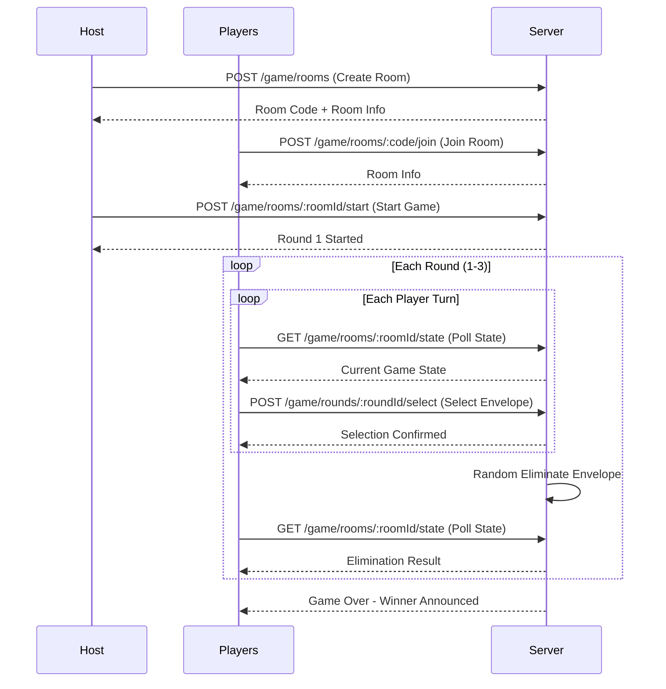

# Lucky Envelope Game API Documentation

## Overview

API endpoints và WebSocket events cho hệ thống game Lucky Envelope (Lì Xì) với cơ chế survival.

**Communication:** Hệ thống sử dụng **Socket.IO** cho real-time communication thay vì polling.

### Game Flow



---

## Base URL

```
/api/v1/game
```

---

## Endpoints

### 1. Room Management

#### 1.1 Create Room

Tạo phòng chơi mới.

```http
POST /rooms
```

**Request Body:**

```json
{
  "displayName": "Player1",
  "walletAddress": "0x1234..." // Optional
}
```

**Response (201 Created):**

```json
{
  "success": true,
  "data": {
    "room": {
      "id": "1",
      "code": "ABC123",
      "status": "WAITING",
      "currentPhase": "WAITING_FOR_PLAYERS",
      "totalPrizeCents": 2800,
      "remainingPrizeCents": 2800,
      "currentRound": 0,
      "createdAt": "2026-01-17T10:00:00Z"
    },
    "player": {
      "id": "1",
      "displayName": "Player1",
      "isHost": true,
      "isEliminated": false,
      "turnOrder": 0
    }
  }
}
```

---

#### 1.2 Get Room by Code

Lấy thông tin phòng theo mã phòng.

```http
GET /rooms/:code
```

**Response (200 OK):**

```json
{
  "success": true,
  "data": {
    "id": "1",
    "code": "ABC123",
    "status": "WAITING",
    "currentPhase": "WAITING_FOR_PLAYERS",
    "totalPrizeCents": 2800,
    "remainingPrizeCents": 2800,
    "currentRound": 0,
    "players": [
      {
        "id": "1",
        "displayName": "Player1",
        "isHost": true,
        "isEliminated": false,
        "turnOrder": 0
      }
    ],
    "playersCount": 1,
    "maxPlayers": 4
  }
}
```

---

#### 1.3 Join Room

Tham gia phòng chơi.

```http
POST /rooms/:code/join
```

**Request Body:**

```json
{
  "displayName": "Player2",
  "walletAddress": "0x5678..." // Optional
}
```

**Response (200 OK):**

```json
{
  "success": true,
  "data": {
    "room": {
      "id": "1",
      "code": "ABC123",
      "status": "WAITING",
      "currentPhase": "WAITING_FOR_PLAYERS",
      "playersCount": 2,
      "maxPlayers": 4
    },
    "player": {
      "id": "2",
      "displayName": "Player2",
      "isHost": false,
      "isEliminated": false,
      "turnOrder": 1
    }
  }
}
```

**Error Responses:**

- `400` - Room is full (4 players)
- `400` - Game already started
- `404` - Room not found

---

#### 1.4 Leave Room

Rời khỏi phòng (chỉ khi game chưa bắt đầu).

```http
POST /rooms/:roomId/leave
```

**Request Body:**

```json
{
  "playerId": "2"
}
```

**Response (200 OK):**

```json
{
  "success": true,
  "message": "Left room successfully"
}
```

---

#### 1.5 Start Game

Bắt đầu game (chỉ host, cần đủ 4 người).

```http
POST /rooms/:roomId/start
```

**Request Body:**

```json
{
  "playerId": "1" // Must be host
}
```

**Response (200 OK):**

```json
{
  "success": true,
  "data": {
    "room": {
      "id": "1",
      "code": "ABC123",
      "status": "PLAYING",
      "currentPhase": "SELECTING_ENVELOPE",
      "currentRound": 1,
      "currentTurnIndex": 0,
      "turnDeadline": "2026-01-17T10:01:00Z"
    },
    "round": {
      "id": "1",
      "roundNumber": 1,
      "turnOrder": ["3", "1", "4", "2"],
      "availableEnvelopes": ["A", "B", "C", "D"],
      "selections": []
    }
  }
}
```

**Error Responses:**

- `400` - Not enough players (need 4)
- `403` - Only host can start game

---

### 2. Game State (Polling)

#### 2.1 Get Full Game State

Lấy trạng thái đầy đủ của game (dùng cho polling).

```http
GET /rooms/:roomId/state
```

**Query Parameters:**

- `playerId` (required): ID của người chơi đang poll

**Response (200 OK) - During SELECTING_ENVELOPE phase:**

```json
{
  "success": true,
  "data": {
    "room": {
      "id": "1",
      "code": "ABC123",
      "status": "PLAYING",
      "currentPhase": "SELECTING_ENVELOPE",
      "totalPrizeCents": 2800,
      "remainingPrizeCents": 2800,
      "currentRound": 1,
      "currentTurnIndex": 1,
      "turnDeadline": "2026-01-17T10:01:30Z"
    },
    "players": [
      {
        "id": "1",
        "displayName": "Player1",
        "isHost": true,
        "isEliminated": false,
        "turnOrder": 1,
        "hasReceivedEnvelope": false
      },
      {
        "id": "2",
        "displayName": "Player2",
        "isHost": false,
        "isEliminated": false,
        "turnOrder": 3,
        "hasReceivedEnvelope": false
      },
      {
        "id": "3",
        "displayName": "Player3",
        "isHost": false,
        "isEliminated": false,
        "turnOrder": 0,
        "hasReceivedEnvelope": true
      },
      {
        "id": "4",
        "displayName": "Player4",
        "isHost": false,
        "isEliminated": false,
        "turnOrder": 2,
        "hasReceivedEnvelope": false
      }
    ],
    "currentRound": {
      "id": "1",
      "roundNumber": 1,
      "turnOrder": ["3", "1", "4", "2"],
      "currentTurnPlayerId": "1",
      "availableEnvelopes": ["B", "C", "D"],
      "availableReceivers": ["1", "4", "2"],
      "selections": [
        {
          "selectorId": "3",
          "receiverId": "3",
          "envelope": "A",
          "selectionOrder": 0
        }
      ]
    },
    "myTurn": true,
    "myPlayer": {
      "id": "1",
      "displayName": "Player1",
      "isHost": true,
      "isEliminated": false,
      "turnOrder": 1,
      "hasReceivedEnvelope": false
    },
    "timeRemaining": 45
  }
}
```

**Response (200 OK) - During REVEALING phase:**

```json
{
  "success": true,
  "data": {
    "room": {
      "id": "1",
      "code": "ABC123",
      "status": "PLAYING",
      "currentPhase": "REVEALING",
      "currentRound": 1
    },
    "players": [...],
    "currentRound": {
      "id": "1",
      "roundNumber": 1,
      "selections": [...],
      "eliminatedEnvelope": "C",
      "eliminatedPlayer": {
        "id": "4",
        "displayName": "Player4"
      },
      "eliminationPrizeCents": 100
    },
    "myTurn": false,
    "myPlayer": {...}
  }
}
```

**Response (200 OK) - During GAME_OVER phase:**

```json
{
  "success": true,
  "data": {
    "room": {
      "id": "1",
      "code": "ABC123",
      "status": "FINISHED",
      "currentPhase": "GAME_OVER",
      "currentRound": 3,
      "totalPrizeCents": 2800,
      "remainingPrizeCents": 2200
    },
    "players": [
      {
        "id": "1",
        "displayName": "Player1",
        "isEliminated": true,
        "prizeReceivedCents": 100
      },
      {
        "id": "2",
        "displayName": "Player2",
        "isEliminated": false,
        "prizeReceivedCents": 2200
      },
      {
        "id": "3",
        "displayName": "Player3",
        "isEliminated": true,
        "prizeReceivedCents": 200
      },
      {
        "id": "4",
        "displayName": "Player4",
        "isEliminated": true,
        "prizeReceivedCents": 300
      }
    ],
    "winner": {
      "id": "2",
      "displayName": "Player2",
      "prizeReceivedCents": 2200
    },
    "roundHistory": [
      {
        "roundNumber": 1,
        "eliminatedPlayer": "Player1",
        "eliminatedEnvelope": "B",
        "prizeCents": 100
      },
      {
        "roundNumber": 2,
        "eliminatedPlayer": "Player3",
        "eliminatedEnvelope": "A",
        "prizeCents": 200
      },
      {
        "roundNumber": 3,
        "eliminatedPlayer": "Player4",
        "eliminatedEnvelope": "C",
        "prizeCents": 300
      }
    ]
  }
}
```

---

### 3. Round Actions

#### 3.1 Select Envelope

Chọn bao lì xì và gán cho người chơi.

```http
POST /rounds/:roundId/select
```

**Request Body:**

```json
{
  "playerId": "1",
  "envelope": "B",
  "receiverId": "4"
}
```

**Response (200 OK):**

```json
{
  "success": true,
  "data": {
    "selection": {
      "id": "2",
      "selectorId": "1",
      "receiverId": "4",
      "envelope": "B",
      "selectionOrder": 1,
      "isAutoSelected": false
    },
    "nextTurn": {
      "currentTurnIndex": 2,
      "currentTurnPlayerId": "4",
      "turnDeadline": "2026-01-17T10:02:30Z",
      "availableEnvelopes": ["C", "D"],
      "availableReceivers": ["1", "2"]
    }
  }
}
```

**Error Responses:**

- `400` - Not your turn
- `400` - Invalid envelope (already taken or doesn't exist)
- `400` - Invalid receiver (already has envelope or is you)
- `400` - Time expired (will auto-select)

---

#### 3.2 Get Round Details

Lấy chi tiết của một vòng chơi.

```http
GET /rounds/:roundId
```

**Response (200 OK):**

```json
{
  "success": true,
  "data": {
    "id": "1",
    "roomId": "1",
    "roundNumber": 1,
    "turnOrder": ["3", "1", "4", "2"],
    "selections": [
      {
        "selectorId": "3",
        "selectorName": "Player3",
        "receiverId": "3",
        "receiverName": "Player3",
        "envelope": "A",
        "selectionOrder": 0,
        "isAutoSelected": false
      },
      {
        "selectorId": "1",
        "selectorName": "Player1",
        "receiverId": "4",
        "receiverName": "Player4",
        "envelope": "B",
        "selectionOrder": 1,
        "isAutoSelected": false
      }
    ],
    "eliminatedEnvelope": null,
    "eliminatedPlayer": null,
    "eliminationPrizeCents": 100,
    "isCompleted": false
  }
}
```

---

### 4. Background Processing

#### 4.1 Process Turn Timeout (Internal/Cron)

Xử lý timeout khi người chơi không chọn trong 1 phút.

```http
POST /internal/process-timeouts
```

> **Note:** Endpoint này được gọi bởi cron job hoặc scheduler, không public.

**Response (200 OK):**

```json
{
  "success": true,
  "data": {
    "processedRooms": 2,
    "autoSelections": [
      {
        "roomId": "1",
        "roundId": "1",
        "playerId": "3",
        "envelope": "D",
        "receiverId": "2"
      }
    ]
  }
}
```

---

## Data Types

### Enums

```typescript
enum GameRoomStatus {
  WAITING = 'WAITING',
  PLAYING = 'PLAYING',
  FINISHED = 'FINISHED',
  CANCELLED = 'CANCELLED',
}

enum GamePhase {
  WAITING_FOR_PLAYERS = 'WAITING_FOR_PLAYERS',
  SELECTING_ENVELOPE = 'SELECTING_ENVELOPE',
  REVEALING = 'REVEALING',
  VOTING = 'VOTING',
  ROUND_END = 'ROUND_END',
  GAME_OVER = 'GAME_OVER',
}

enum Envelope {
  A = 'A',
  B = 'B',
  C = 'C',
  D = 'D',
}
```

### Prize Distribution

| Round  | Eliminated Player Prize | Description          |
| ------ | ----------------------- | -------------------- |
| 1      | $1.00 (100 cents)       | First elimination    |
| 2      | $2.00 (200 cents)       | Second elimination   |
| 3      | $3.00 (300 cents)       | Third elimination    |
| Winner | $22.00 (2200 cents)     | Remaining prize pool |

**Total:** $28.00 (2800 cents)

---

## WebSocket (Socket.IO)

### Connection

```typescript
import { io } from 'socket.io-client'

const socket = io('http://localhost:3000/game', {
  auth: {
    token: 'your-jwt-token',
  },
  // or via query params
  // query: { token: 'your-jwt-token' }
})
```

### Client → Server Events

| Event                  | Payload                                                                 | Description           |
| ---------------------- | ----------------------------------------------------------------------- | --------------------- |
| `game:join_room`       | `{ roomCode: string, displayName: string }`                             | Join a game room      |
| `game:leave_room`      | `{ roomId: string }`                                                    | Leave the room        |
| `game:start`           | `{ roomId: string }`                                                    | Start the game        |
| `game:select_envelope` | `{ roundId: string, envelope: 'A'\|'B'\|'C'\|'D', receiverId: string }` | Select envelope       |
| `game:advance_round`   | `{ roomId: string }`                                                    | Advance to next round |

### Server → Client Events

| Event                    | Payload                          | Description                         |
| ------------------------ | -------------------------------- | ----------------------------------- |
| `game:room_state`        | `GameStateEntity`                | Full room/game state                |
| `game:player_joined`     | `{ player, playersCount }`       | Player joined room                  |
| `game:player_left`       | `{ playerId, message }`          | Player left/disconnected            |
| `game:started`           | `GameStateEntity`                | Game has started                    |
| `game:turn_changed`      | `GameStateEntity`                | Turn changed to next player         |
| `game:envelope_selected` | `{ selection, nextTurn }`        | Envelope was selected               |
| `game:round_completed`   | `{ round }`                      | Round finished, showing elimination |
| `game:game_over`         | `GameStateEntity`                | Game finished, winner announced     |
| `game:timeout_warning`   | `{ secondsRemaining, playerId }` | Warning: turn ending soon           |
| `game:error`             | `{ message }`                    | Error occurred                      |

### Client Implementation Example

```typescript
import { io, Socket } from 'socket.io-client'

class GameSocketClient {
  private socket: Socket

  constructor(token: string) {
    this.socket = io('http://localhost:3000/game', {
      auth: { token },
    })

    this.setupListeners()
  }

  private setupListeners() {
    // Connection events
    this.socket.on('connect', () => {
      console.log('Connected to game server')
    })

    this.socket.on('disconnect', () => {
      console.log('Disconnected from game server')
    })

    // Game events
    this.socket.on('game:room_state', (state) => {
      console.log('Room state updated:', state)
      // Update UI with new state
    })

    this.socket.on('game:player_joined', ({ player, playersCount }) => {
      console.log(`${player.displayName} joined! (${playersCount}/4)`)
    })

    this.socket.on('game:started', (state) => {
      console.log('Game started!', state)
    })

    this.socket.on('game:turn_changed', (state) => {
      console.log('Turn changed:', state.currentRound?.currentTurnPlayerId)
    })

    this.socket.on('game:envelope_selected', ({ selection, nextTurn }) => {
      console.log('Envelope selected:', selection)
    })

    this.socket.on('game:round_completed', ({ round }) => {
      console.log('Round completed! Eliminated:', round.eliminatedPlayer)
    })

    this.socket.on('game:game_over', (state) => {
      console.log('Game over! Winner:', state.winner)
    })

    this.socket.on('game:timeout_warning', ({ secondsRemaining, playerId }) => {
      console.log(`Warning: ${secondsRemaining}s remaining for player ${playerId}`)
    })

    this.socket.on('game:error', ({ message }) => {
      console.error('Game error:', message)
    })
  }

  // Actions
  joinRoom(roomCode: string, displayName: string) {
    return this.socket.emitWithAck('game:join_room', { roomCode, displayName })
  }

  leaveRoom(roomId: string) {
    return this.socket.emitWithAck('game:leave_room', { roomId })
  }

  startGame(roomId: string) {
    return this.socket.emitWithAck('game:start', { roomId })
  }

  selectEnvelope(roundId: string, envelope: string, receiverId: string) {
    return this.socket.emitWithAck('game:select_envelope', {
      roundId,
      envelope,
      receiverId,
    })
  }

  advanceRound(roomId: string) {
    return this.socket.emitWithAck('game:advance_round', { roomId })
  }

  disconnect() {
    this.socket.disconnect()
  }
}

// Usage
const gameClient = new GameSocketClient('your-jwt-token')

// Join room
const result = await gameClient.joinRoom('ABC123', 'Player1')
if (result.success) {
  console.log('Joined room:', result.data.room.code)
}

// Start game when ready
await gameClient.startGame(result.data.room.id)

// Select envelope on your turn
await gameClient.selectEnvelope(roundId, 'A', targetPlayerId)
```

---

## Error Codes

| Code                 | Message                           | Description                   |
| -------------------- | --------------------------------- | ----------------------------- |
| `ROOM_NOT_FOUND`     | Room not found                    | Invalid room code/ID          |
| `ROOM_FULL`          | Room is full                      | Already 4 players             |
| `GAME_STARTED`       | Game already started              | Cannot join/leave             |
| `NOT_HOST`           | Only host can perform this action | Start game permission         |
| `NOT_ENOUGH_PLAYERS` | Need 4 players to start           | Minimum player requirement    |
| `NOT_YOUR_TURN`      | It's not your turn                | Wrong player trying to select |
| `INVALID_ENVELOPE`   | Envelope not available            | Already taken                 |
| `INVALID_RECEIVER`   | Cannot assign to this player      | Already has envelope          |
| `TURN_EXPIRED`       | Turn time expired                 | Auto-selection applied        |
| `PLAYER_NOT_IN_ROOM` | Player not in this room           | Invalid player ID             |

---

## Webhook Events (Future)

For smart contract integration, these events can be emitted:

```json
{
  "event": "GAME_COMPLETED",
  "data": {
    "roomId": "1",
    "roomCode": "ABC123",
    "winner": {
      "id": "2",
      "walletAddress": "0x5678...",
      "prizeCents": 2200
    },
    "eliminatedPlayers": [
      {
        "id": "1",
        "walletAddress": "0x1234...",
        "prizeCents": 100,
        "roundEliminated": 1
      }
    ],
    "timestamp": "2026-01-17T10:15:00Z"
  }
}
```
